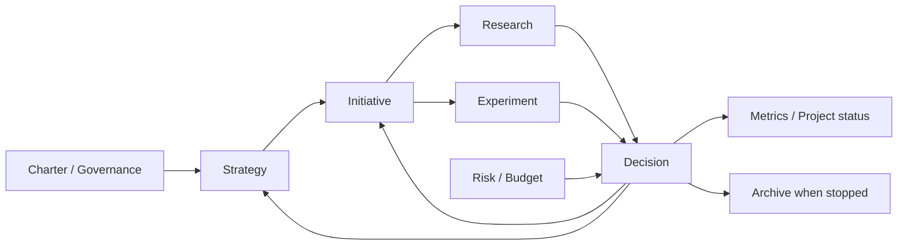

# 管理構造と設計理由

## 目的

この構造は、AIがセッションをまたいで現在地を復元し、調査・実装・整理を進めながら、人間が目的、権限、例外、重要判断を保持できるようにするためのものです。

中心にあるのはフォルダ構成ではなく、次の五つの分離です。

1. 恒久方針と可変戦略。
2. 主張と証拠。
3. 検証前の期待と検証後の結果。
4. 判断当時の理由と後日判明したOutcome。
5. 知識の正本と未完了作業のキュー。

## 三層モデル

### 1. Constitution layer

頻繁には変えず、人間が権限を保持する層です。

- `docs/CHARTER.md`: 目的、Scope、Non-goals、成功状態、制約。
- `docs/GOVERNANCE.md`: AIと人間の権限、承認ゲート。
- `docs/INFORMATION_POLICY.md`: 情報区分、保存・AI入力・公開の境界。
- `AGENTS.md`: AIが毎回守る最小運用規則。

### 2. Direction layer

新しい証拠で更新する層です。

- `PROJECT.md`: 現在地と次アクション。
- `docs/STRATEGY.md`: 現在のアプローチ、優先順位、仮説、再検討条件。
- `metrics/README.md`: 成果指標と運用品質。
- `risks/README.md`: 現在の重要リスク。

### 3. Evidence and execution layer

日々増える記録です。

- Initiativeは成果へ向かう作業単位。
- Researchは主張と根拠。
- Experimentは事前登録と実測。
- Decisionは重要判断、承認、例外。
- Budgetは予定額と実績額。
- Archiveは失敗、中止、旧版と学習。

## 情報フロー

AIは矢印に沿って正本を更新します。たとえばResearchを書くだけで終わらず、判断が変わった場合はDecision、Initiative、Metrics、PROJECTの必要箇所まで同期します。

## 正本マトリクス

| 情報 | 正本 | 正本にしない場所 |
|---|---|---|
| 目的、Scope、成功状態 | Charter | Issue、チャット、Strategy |
| 現在の優先順位・仮説 | Strategy | Charter、Issue |
| 現在地・次アクション | PROJECT | チャットだけのメモ |
| 調査の主張と出典 | Research | Decisionへの長文複製 |
| 事前条件と実測 | Experiment | Issueのチェックリストだけ |
| 重要判断・承認・例外 | Decision | チャットだけの承認 |
| 未完了の実行項目 | GitHub Issue | 複数文書へのTODO複製 |
| レビュー対象の差分 | Branch / Pull Request | 直接main変更のみの運用 |
| 現金予定・実績 | Budget ledger | Experiment内だけの金額 |

## IDとリンク

IDは、ファイル名が変わっても参照を保ち、AIが横断検索しやすくするために使います。

- `WRK-NNN`: Initiative
- `RES-NNN`: Research
- `EXP-NNN`: Experiment
- `DEC-NNN`: Decision / Approval / Exception
- `RSK-NNN`: Risk

各レコードは台帳からリンクし、関連IDをfront matterと本文に記載します。詳細を別レコードへコピーせず、リンクします。

## 追記型Decision

Decisionは、後知恵による履歴改変を防ぐため、判断当時の本文を保ちます。

- `Decision / Reason / Evidence / Alternatives / Risks / Revisit condition` は判断時点の記録。
- 新しい証拠は関連ResearchまたはExperimentへ記録。
- 結果は`Outcome addenda`へ日付付きで追記。
- 方針変更は新しいDecisionを作り、旧Decisionを`Superseded`にする。

Git履歴だけに依存せず、現在のファイルを読むだけで判断の変遷を追えるようにします。

## AI自律と人間統制

AIは読み取り、整理、下書き、実装、テスト、整合性更新を広く担当します。一方、人間は目的、情報境界、支出、外部行為、本番変更、法的責任を保持します。

重要なのは「AIが何を作れるか」ではなく、「どの結果を誰が承認するか」です。承認はDecisionとして対象、上限、期限、最大損失を記録し、無期限・無制限の包括承認を避けます。

## 最小構造を保つ理由

小規模時にはMarkdown、Git、検索で十分なことが多く、DBやダッシュボードを先に作ると管理システム自体がプロジェクト化します。自動化は次の順で追加します。

1. 人間とAIが守る明確な運用規則。
2. 構造検証スクリプト。
3. 実際に観測された更新漏れや規模増加への限定的な自動化。
4. 必要になった場合だけDB、Project board、外部システム連携。

再設計の判断基準は[SELF_REVIEW.md](SELF_REVIEW.md)に置きます。

## 汎用化のために追加した点

- 特定の事業候補ではなく、業務全般を扱えるInitiativeへ抽象化。
- 会社利用を前提に、Information PolicyとRiskをCoreへ追加。
- Decisionを通常判断だけでなく、承認・例外の記録にも利用。
- GitHub Copilot向け入口と、AIルールの正本を分離。
- 構造、リンク、ID、秘密情報らしい文字列を検査するツールを追加。
- 公開テンプレートと会社側業務リポジトリの一方向境界を明示。

## 意図的に含めないもの

- 特定会社の組織図、承認者名、規程、データ分類の最終定義。
- 業務案件、顧客情報、個人情報、認証情報。
- 100点満点の自動評価や、自動承認。
- 全作業のIssue化、複雑なProject board、外部SaaS依存。
- 会社固有の法務・セキュリティ判断の代替。
